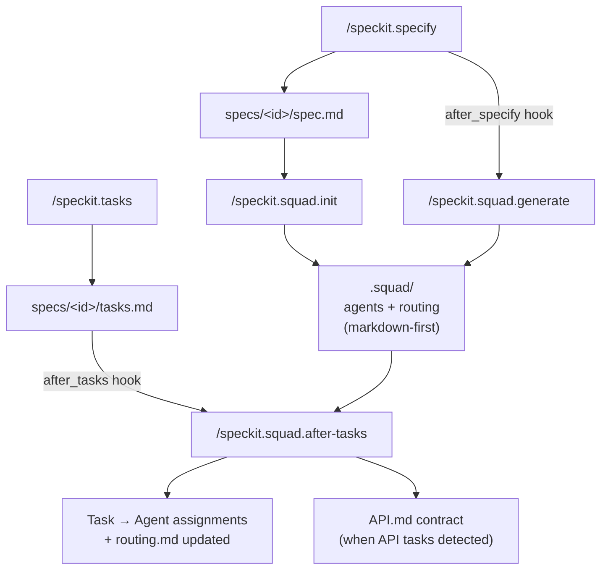
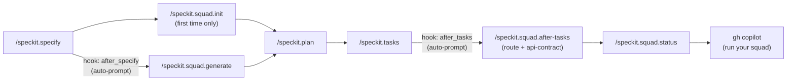

# spec-kit-squad

A [Spec Kit](https://github.com/github/spec-kit) extension that bridges
[Squad](https://bradygaster.github.io/squad/) — bootstrapping and
synchronizing an AI agent team directly from your spec.

**Speckit generates the *what*** (spec → plan → tasks).  
**Squad manages the *who*** (agents with specialized capabilities).  
**This extension connects them.**

---

## How It Works



After you specify your project, the extension reads the spec, infers
technology domains and roles, and generates a Squad team to match. As your
spec evolves, `generate` keeps the team in sync. When tasks are generated,
`after-tasks` distributes them to the right agents and prepares API contract
docs when needed — both triggered automatically via hooks.

---

## Requirements

- [Spec Kit](https://github.com/github/spec-kit) `>=0.8.11`
- [Squad](https://bradygaster.github.io/squad/) `>=0.9.4`

```bash
npm install -g @bradygaster/squad-cli
```

---

## Installation

```bash
specify extension add squad --from https://github.com/DouglasHennrich/spec-kit-squad/archive/refs/tags/v2.1.0.zip
```

Or for local development:

```bash
specify extension add squad --dev /path/to/spec-kit-squad
```

---

## Commands

> **Invoking commands by tool:**
>
> - **Claude Code / VS Code Copilot:** Type `/speckit.squad.<command>` directly
> - **GitHub Copilot CLI:** Type `/agents` → select `speckit.squad.<command>` → enter your prompt

### `/speckit.squad.init`

Bootstrap a Squad team from the current spec. Run this once after your
initial `/speckit.specify`.

- Reads `specs/<id>/spec.md` and (optionally) `specs/<id>/tasks.md`
- Infers technology domains, roles, and cross-cutting concerns
- Runs `squad init` if `.squad/` doesn't exist
- Creates agent definitions in `.squad/agents/`
- Generates routing rules in `.squad/routing.md`
- Uses markdown-first `.squad/` artifacts and definitions in `.squad/agents/`, `team.md`, and `routing.md`; no root `squad.config.ts` file is required

```
/speckit.squad.init
```

---

### `/speckit.squad.generate`

Re-generate agent definitions as the spec evolves. Safe to run repeatedly —
agents are updated in place; removed domains are marked `inactive`, not
deleted. Also triggered by the `after_specify` hook.

```
/speckit.squad.generate
/speckit.squad.generate frontend   # limit to a specific domain
```

---

### `/speckit.squad.route`

Route open Speckit tasks to Squad agents using capability matching. Also
triggered by the `after_tasks` hook.

```
/speckit.squad.route
/speckit.squad.route --update-tasks   # annotate tasks.md with assignments
```

---

### `/speckit.squad.api-contract`

Analyze open tasks and generate or update an `API.md` contract document when
tasks include API surface changes (new endpoints, request/response shape
changes, DTO or OpenAPI updates). Assigns ownership of each endpoint section
to the responsible Squad agent.

Skips silently when no API-impacting tasks are found — safe to run at any
time.

```
/speckit.squad.api-contract
/speckit.squad.api-contract --output=docs/features/my-feature/API.md
```

---

### `/speckit.squad.after-tasks`

Orchestrator that runs the full post-task flow in order:

1. `/speckit.squad.route` — assigns agents to every open task
2. `/speckit.squad.api-contract` — generates API contract docs when needed

This is the command invoked by the `after_tasks` hook. Running it directly is
equivalent to running both sub-commands in sequence.

```
/speckit.squad.after-tasks
/speckit.squad.after-tasks --update-tasks
```

---

### `/speckit.squad.status`

Health check: cross-reference the spec, tasks, and squad to surface coverage
gaps and idle agents.

```
/speckit.squad.status
/speckit.squad.status --brief   # summary only
```

---

## Configuration

After installation, copy the config template:

```bash
cp .specify/extensions/squad/squad-config.template.yml \
   .specify/extensions/squad/squad-config.yml
```

Key options:

| Option | Default | Description |
| --- | --- | --- |
| `agent_model` | `claude-sonnet-4` | Model used when generating agents |
| `routing_strategy` | `capability-match` | `capability-match` or `round-robin` |
| `squad_root` | `.squad` | Path to Squad root directory |
| `model_tiers.full` | `claude-opus-4` | Model for complex tasks |
| `model_tiers.standard` | `claude-sonnet-4` | Model for standard tasks |
| `model_tiers.lightweight` | `claude-haiku-4.5` | Model for simple tasks |

### Markdown-First Workflow

`/speckit.squad.init` bootstraps your Squad `.squad/` directory with agent
charters, `team.md`, and `routing.md`. These markdown artifacts are the
authoritative source of truth.

`/speckit.squad.generate` keeps `.squad/` artifacts in sync as the spec evolves
— adding new agents, updating capabilities, and reflecting model tier
changes. You can edit these files manually; `generate` will diff against the
existing content rather than blindly overwriting it.

In markdown-first mode, no root `squad.config.ts` file is required.

---

## Skills

Both `/speckit.squad.init` and `/speckit.squad.generate` automatically install
the following skill into your project's `.github/skills/` directory:

### `speckit-implement-squad-route`

Overrides the default `/speckit.implement` behavior so that tasks are
distributed to specialized Squad agents **in parallel** instead of being
executed sequentially by a single agent.

At runtime the skill reads the `→AgentName` annotations written by
`/speckit.squad.route` into `tasks.md` and groups tasks by agent before
dispatching them.

**Installation is idempotent** — if the file already exists in your project
(e.g. you've customized it), `init` and `generate` will never overwrite it.

---

## Hooks

| Hook | Command | Behavior |
| --- | --- | --- |
| `after_specify` | `speckit.squad.generate` | Always runs (prompts before executing) |
| `after_tasks` | `speckit.squad.after-tasks` | Always runs (prompts before executing) |

---

## Typical Workflow



Steps marked **auto-prompt** run automatically via hooks — you confirm before
they execute. You only need to invoke `/speckit.squad.init` manually once,
on first setup.

---

## Troubleshooting

**`squad: command not found`**
Squad is not installed. Run `npm install -g @bradygaster/squad-cli` and verify with `squad --version`.

**`/speckit.squad.init` reports no spec found**
Run `/speckit.specify` first — the init command reads `specs/<id>/spec.md`.

**Agents not appearing after init**
Check `.squad/agents/` exists. If the directory is missing, Squad CLI may not have initialized correctly. Try `squad init` manually, then re-run `/speckit.squad.init`.

**Hook fires but `API.md` is not generated**
`/speckit.squad.after-tasks` only creates `API.md` when it detects tasks with explicit API surface changes (new endpoints, request/response shape changes, DTO or OpenAPI updates). If no such tasks are found, it exits cleanly with no file changes — this is expected behavior, not a bug.

**Hook fires unexpectedly**
Both hooks (`after_specify`, `after_tasks`) always run with a confirmation prompt — they cannot be silenced by setting `optional`. To disable a hook entirely, remove its entry from the `hooks:` section in your local copy of `.specify/extensions/squad/extension.yml`.

---

## License

MIT
